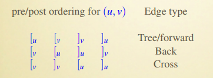
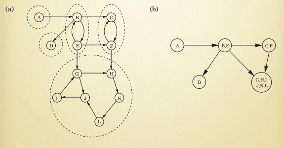
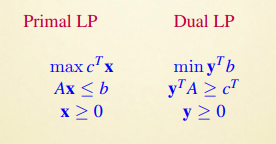
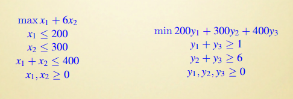

# 算法原理复习笔记

###### lgq part

## Graph Algorithms, Revisited

### Types of edges

+ 树边（tree edges），回边（back edges）
+ PREVISIT，POSTVISIT，遍历的到达时间和离开时间
+ 前向边（forward edges），交叉边（cross edges）

### Directed Acyclic Graph (DAG)

+ Linearization / Topologically Sort

  All DAGs can be linearized

  按 post number（遍历离开的时间）降序排列

+ 无环，可线性化，没有回边 are the same thing

+ Every DAG has at least a source and a sink

### Strongly Connected Components (SCC)

+ 有向图中 **connected** 的定义：两个节点 u，v，u 可以到达 v，v 也可以到达 u。

+ Every directed graph is a DAG of its SCC

  

  将 SCC 视为一个节点后生成的图必是 DAG，否则如果出现环的话，说明环上的 SCC 节点应该是同一个节点。

+ SCC 中所有节点的 highest post number 可以**代表**一个 SCC：

  + highest post number 中最高的必定 lie in source SCC。
  + A 和 B 是两个 SCC，A 有边指向 B，则说明 A 中的 highest post number 高于 B 中的。
  + SCC 也可以线性化，方法是按 highest post number 大小降序排列。

+ 所有节点中的 highest post number 必定 lie in source SCC，但是 lowest post number 并不一定 lie in sink SCC，所以为了寻找 sink SCC，可以将原图中的边倒置。

### Dijkstra

+ input: directed or undirected, positive edge length，复杂度是 O(|V|)
+ Dijkstra 算法的关键是所有已遍历到的节点已经计算到了最小路径
+ 为了支持负边，引入 Bellman-Ford 算法，每次迭代都计算一遍所有的边，复杂度是 O(|V|·|E|)
+ 如果在 V-1 次迭代以后仍然没有收敛，则说明有负环
+ 在有负边的 DAG 中，仍然可以使用 Dijkstra 算法，只要按照线性化之后的顺序 update 即可。

## NP Problems

### Minimum Spanning Trees (MST)

+ Kruskal's algorithm: 每次加一条最短的边
+ Prim's algorithm: 每次加一个距离最短的节点

### 2-SAT

### NP-Complete Problem

+ 如果所有 NP 问题都能多项式时间内归约到某问题，则该问题是 NP-hard 问题。
+ 如果某个问题是 NP 也是 NP-hard，则该问题是 NP-Complete 问题。

## Algorithms with Numbers

仅改变数的进制，不会影响算法的复杂度。

### Addition

任意三个 single-digit 的数相加，结果最多是两位 digit。

最优算法：O(n)，其中 n 是位数

### Multiplication

naive 算法：O(n^2)

可以用 Gauss's trick 优化到大概 O(n^1.59)

### Division

### Modular Arithmetic

### Greatest Common Divisor (GCD)

check if d is gcd(x, y):

### Modular Inverse

+ 如果 gcd(a, N) > 1，则 a 不存在 mod N 的模倒数
+ 如果 gcd(a, N) = 1（a, N 互质），则存在 x, y，使得 ax+Ny=1，所以 x 即为 a mod N 的模倒数

### Fermat's Little Theorem

+ 为什么费马大定理不能用作素数测试，因为这只是个充分条件，即如果 p 是素数，p 满足费马大定理，如果 p 满足费马大定理，p 不一定是素数。
+ Carmichael Number：如果某个合数 N 满足费马大定理，则 N 称为 Carmichael Number
+ Non-Carmichael Number：对于不满足费马大定理的合数 N，一定有至少一半的 a < N 通不过费马测试
+ 所以对于忽略 Carmichael Number 的素数测试，可以选取若干小于 N 的数，判断它们是否通过费马测试，如果全部通过，则 N 大概率是一个素数。

## Linear Programming

最优解一定在可行域的顶点取到，只有两种例外：

+ 没有可行域
+ 可行域是 unbounded，没有最优解

### Simplex Method

从一个顶点开始，寻找更优的邻节点，当没有更优的邻节点时，当前顶点即为最优节点。

### Duality

### Flows in Networks

residual network

## Approximation Algorithms

it's too late

##### Last-modified date: 2020.1.6, 3 p.m.

