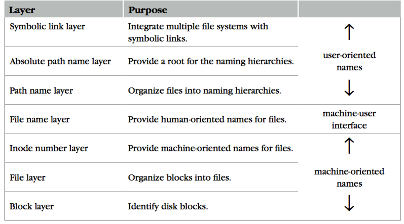
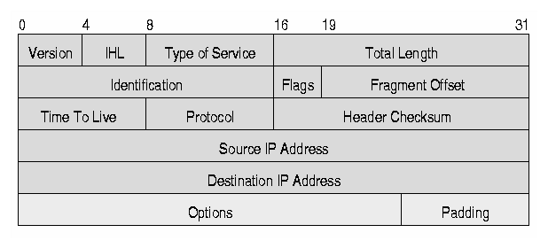
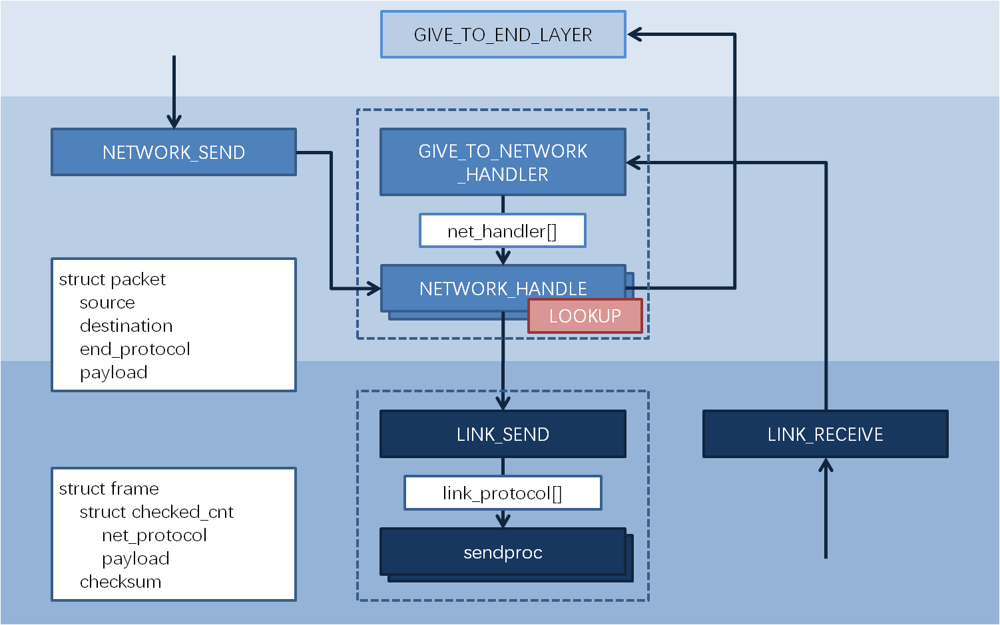

# CSE lecture notes

## Lecture 1  Introduction - System Complexity

+ system complexity
  + emergent properties (surprise)
  + propagation of effects (butterfly effect)
  + incommensurate scaling 
  + trade-offs
+ coping with complexity -- **MALH**
  + **M**odularity
  + **A**bstraction
  + **L**ayering
  + **H**ierarchy

## Lecture 2  Inode-based File System

Seven layers abstraction

### Block layer

block number -> block data

+ One superblock per file system

### File layer

inode -> block numbers

inode + offset -> block number

### Inode number layer

inode number -> inode

+ inode number is the *index* of inode table

  

### File name layer

dir + filename -> inode number

+ filename in current dir
+ Mapping table is saved in directory
  + This means if an inode serves as a **directory**, its blocks store a **table** mapping filename and inode number, and if it serves as a **file** instead, its blocks store pure **data**.

### Path name layer

dir + path -> inode number

+ path starts from current dir
+ path can be deeper than filename
+ Users cannot create links to directories, (avoiding a cycle) but except for `.` and `..`

### Absolute path name layer

path -> inode number

- path can be absolute or relative
- root inode number is **1**
- Both `/.` and `/..` are linked to `/`

### Symbolic link layer

## Lecture 3  File System API

## Lecture 4  Disk I/O

+ polling -> interrupts -> hybrid
+ DMA
+ PIO / Memory-mapped I/O

## Lecture 5  File System Design

+ FFS  Cylinder group
+ New Storage and Media

## Lecture 6  Crash Consistency

### MTTF & Availability

+ MTBF = MTTF + MTTR
+ MTTF 和 Availability 是相互正交的两个概念，可以 MTTF 很大而 Availability 很小，也可以 MTTF 很小而 Availability 很大。

### Redundancy

+ Coding - Hamming Distance
+ Replication
+ Voting - NMR (N-modular redundancy)
+ Repair

### Magnetic disk fault tolerance

+ RAID

### FSCK

### Logging / Journaling

+ D -> Jm -> Jc -> M，在 commit 之前，新 metadata 不会覆盖旧 metadata，可以很方便地回滚。
+ 不 flush -> probabilistic crash consistency，但是在某些 workload 下会有问题，有两种方案：
  + checksum，可以去掉第一个 checksum
  + delayed writes，可以去掉第二个 checksum

## Lecture 7  RPC & NFS

### RPC

+ stub
+ UDP header
+ marshal / unmarshal

### NFS

+ file handler
  + file system identifier
  + inode number
  + generation number
+ stateless on NFS server

## Lecture 8  GFS

+ Master does not use any per-directory data structures
+ Contains chunks (blocks, each 64MB) of a fixed size

### read

    

### write

    
    

## Lecture 9  CDN & DNS

## Lecture 10  Introduction to Network and Link Layer

### Application Layer

+ Entities: client and server
+ Namespace: URL

### Transport Layer

+ Entities: sender and receiver

+ Namespace: port

+ TCP: Retransmit packet if lost

  UDP: Nothing

  

### Network Layer

+ Entities: gateway, bridge, router...
+ Namespace: IP address
+ What to care: next hop decided by route table

### Link Layer

+ Entities: hub, switcher, twisted line, cable line...
+ Namespace: no name needed
+ What to care: physical transfer, error detection

### Link Layer Detail

#### Physical transmission

- parallel transmission
- serial transmission
- VCO
- Manchester Code 0 -> 01, 1 -> 10

#### Multiplexing the link

- Isochronous communication
- Asynchronous communication

#### Framing bits & bit sequence

+ Choose a pattern of bits, e.g., 7 one-bits in a row, as a frame-separator (where a frame
  begins and ends)
+ Bit stuffing: if data contains 6 ones in a row, then add an extra bit 0

#### Detecting transmission errors

+ fault tolerancy -> redundancy
  + simple parity check (2 bits -> 3 bits)
  + 4 bits -> 7 bits

#### Providing a useful interface to the up layer

## Lecture 11  Network Layer

+ IP: Best-effort Network

### NAT

+ Network Address Translation

  

##### Last-modified date: 2019.10.21, 7 p.m.

