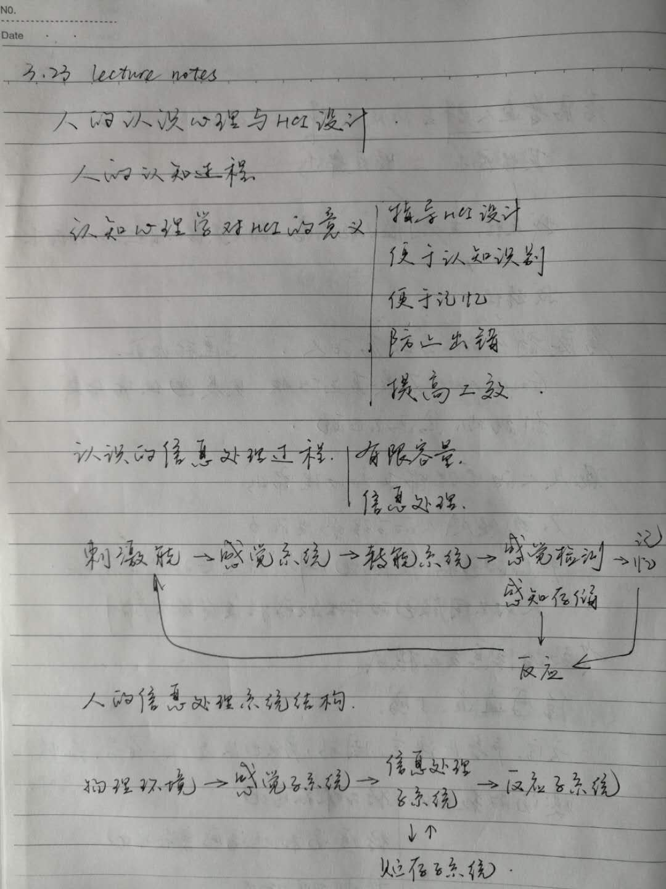
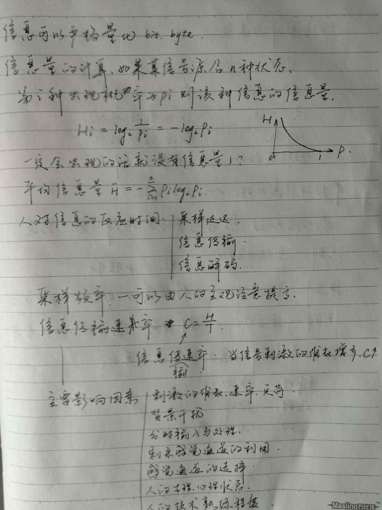
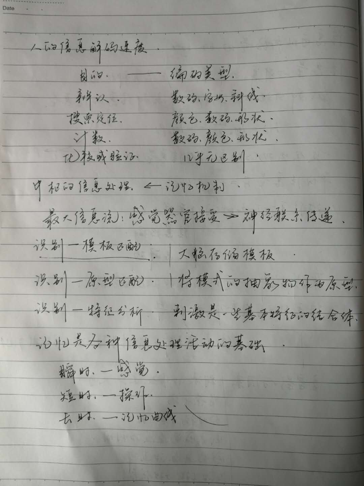
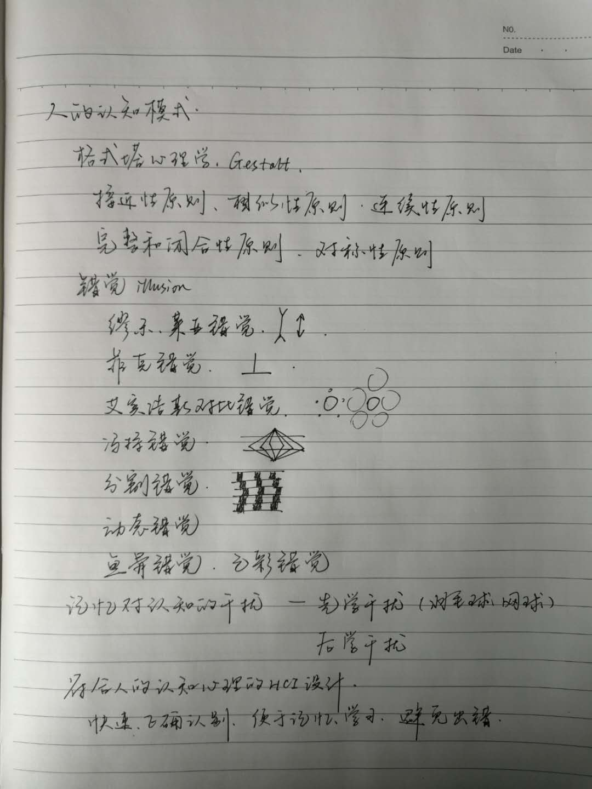

# 3.23 lecture notes

## 问题

+ 格式塔心理学的起源和特征？

  格式塔学派是心理学重要流派之一，兴起于20世纪初的德国，又称为完形心理学。格式塔学派主张人脑的运作原理是整体的，“整体不同于其部件的总和”。例如，我们对一朵花的感知，并非纯粹单单从对花的形状、颜色、大小等感官资讯而来，还包括我们对花过去的经验和印象，加起来才是我们对一朵花的感知。

  格式塔体系的关键特征是整体性、具体化、组织性和恒常性：

  + **整体性**的论据可见于“狗图片”的知觉，图片表现一条狗在树荫下的地面上。对狗的认知并不是首先确定它的各部分（脚、耳朵、鼻子、尾巴等等），并从这些组成部分来推断这是一条狗，而是立刻就将狗作为一个整体来认知。
  + **具体化**是知觉的“建设性”的或“生成性的”方面，这种知觉经验，比起其所基于的感觉刺激，包括了更多外在的空间信息。
  + **组织性**是趋势模糊知觉经验，不稳定地在两个或两个以上不同解释之间往返。
  + **恒常性**知觉认可的简单几何组件，形成独立的旋转，平移、大小以及其他一些变化（如弹性变形，不同的灯光和不同的组件功能）。